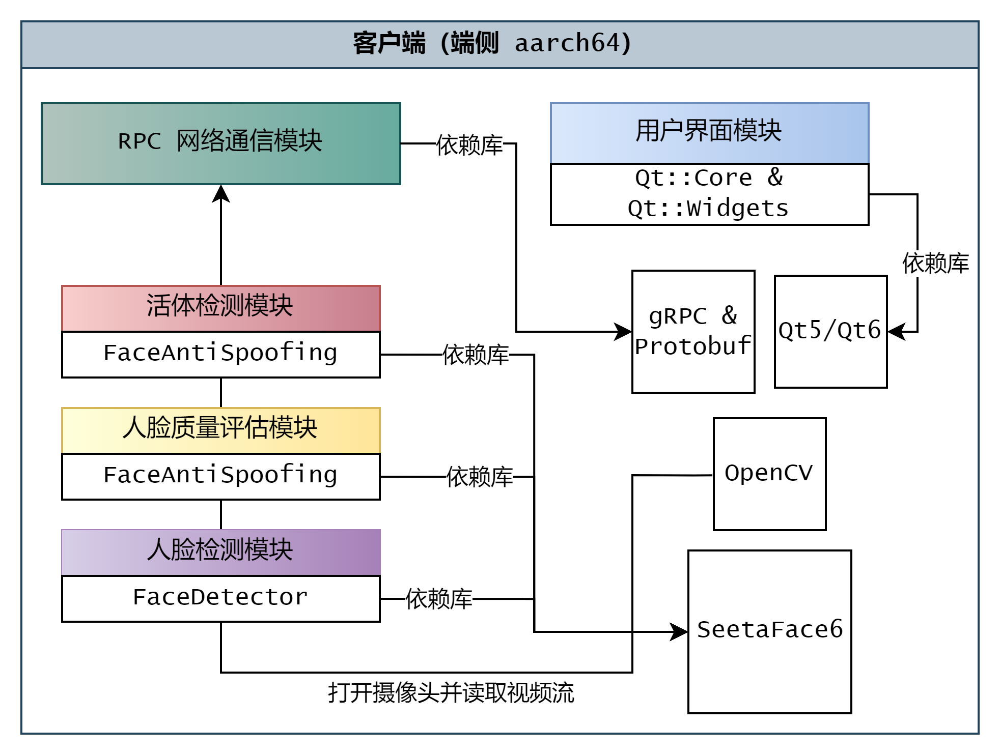
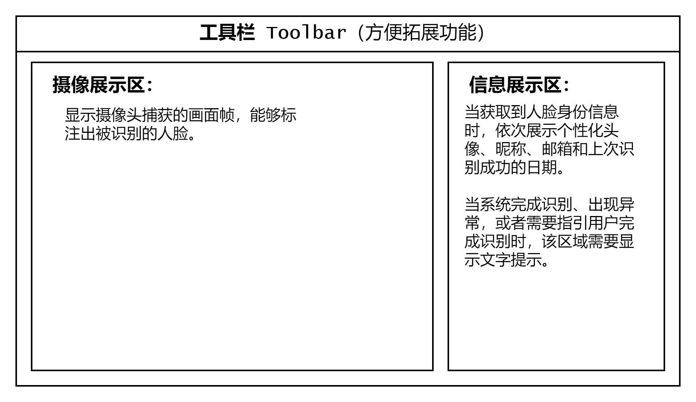

# ArmFaceID-client

原 `ArmFaceID` 的客户端转为多人协作开发，该客户端运行在`aarch64`架构的嵌入式设备上，集成`SeetaFace6`的各个模块，以增强客户端的可靠性。

<a href="https://github.com/YusJade/ArmFaceID?tab=readme-ov-file">
  
</a>

## 协同开发约定

- 使用 `GitHub` + `git` 进行版本管理。
  - [👑Git 关卡式学习](https://learngitbranching.js.org/?locale=zh_CN) 
- 使用 `Clion` 作为集成开发环境 `IDE`。
- 采用 `Google Cpp` 作为编码规范（会采用 `clang-format` 作为代码自动格式化工具）。
  - [📖Google 开源项目风格指南 - Cpp](https://zh-google-styleguide.readthedocs.io/en/latest/google-cpp-styleguide/contents.html)
- 使用 `CMake` 构建工程。
  - [📖CMake 保姆级教程（上）](https://subingwen.cn/cmake/CMake-primer/)
  - [📖CMake 保姆级教程（下）](https://subingwen.cn/cmake/CMake-advanced/?highlight=cmake)

## 如何构建项目

确保安装了所需的库，如果采用编译安装，**且安装位置不在系统默认路径**，则需要配置相关路径（👉 [说明 ](doc/CMake如何指定库的路径.md)）。
要构建本项目，在工程目录下执行：
```bash
git clone --recursive https://github.com/YusJade/ArmFaceID-client.git
cd ./ArmFaceID-client
cmake . -B ./build
cmake --build ./build
```

## 依赖库以及交叉编译清单

以下是开发中所需的库，可自行在主机编译`x86`以及`aarch64`版本，下文也会给出库编译后的下载链接。

**通过 apt 安装的库**
*编译安装* 中的库（除了`SeetaFace6`），其实在 Ubuntu 中皆可通过 apt 进行安装。

**编译安装**（已勾选表示完成了双平台编译）
- [ ] `Qt6.5`： 跨平台`C++`应用开发框架。
- [x] `SeetaFace6`：人脸算法。
- [x] `OpenCV 4.10`：用于调取摄像头，进行图像处理。
- [x] `gRPC 1.67.0-dev`：用于RPC 网络通信。
- [x] `Protobuf 5.27.2`：（集成在`gRPC`内）数据的序列化和反序列化。（作为第三方库与`gRPC 1.67.0-dev`一同编译）
- [x] `absl`: （集成在`gRPC`内）一系列实用的工具库（日志、字符串格式化、命令行参数解析......），这里主要使用其命令行参数解析模块。 

- [x] `spdlog`: 日志库，输出格式化的日志信息。
- [x] `fmt`: （集成在`spdlog`内）字符串格式化库，使用现代`cpp`标准实现更方便的字符串格式化。

完成交叉编译的库文件 👉 [下载](https://github.com/YusJade/ArmFaceID-client/releases)

## 开发目标

- 集成 `SeetaFace6` 的人脸检测模块、活体检测模块、人脸质量评估模块，提高客户端的可靠性。
- 使用 `gRPC` 框架进行网络通信，将人脸识别请求发送至服务端，并处理服务端回传的结果。
- 有清晰易用的用户图形界面`GUI`，向用户展示识别结果、提示用户完成人脸识别流程。
- 使用某种优化方法，降低向服务端发送人脸识别请求的频率。


</br>
### 目标 1：使用 `gRPC` 框架进行网络通信

**负责开发：**
<a href="https://github.com/YusJade" ></a>


**何为 `gRPC` ？：**
`RPC` 即远程过程调用（Remote Procedure Call），可以使得客户端程序调用服务端功能变得像调用本地的方法一样， `gRPC`是谷歌开发的一套实现`RPC`通信机制的框架。

**如何开始开发`gRPC`：**
获得编译后的`gRPC`库后，需要为客户端和服务端定义一套“协议”。它用于约定二者通讯时的消息格式以及可用的服务，这个“协议”需要写在一个`.proto`文件中，可使用`gRPC`库中提供的编译器将其编译为我们需要的`.cpp/.h`文件。

**如何开发`gRPC`：**

> `gRPC` 文档 🚅 [Quick start](https://grpc.io/docs/languages/cpp/quickstart/)

**具体的开发目标：**
- 实现 `RPC` 异步客户端，能够异步地处理响应。
- 调用服务器的人脸识别服务，获取识别结果和关联的用户信息。

### 目标 2：使用 `Qt` 搭建用户图形界面

**负责开发：**
<a href="https://github.com/BorderArea01" ></a><a href="https://github.com/YusJade" ></a>


`UI`功能示意图如下：



- 界面简洁明了，功能指示明确。
- 使用纯代码搭建界面，方便维护。
- 合理使用设计模式与`Qt`槽/信号机制，保持界面逻辑与业务逻辑的低耦合。

### 目标 3：集成人脸检测模块（前置）

> `SeetaFace6` [官方教程文档](https://github.com/seetafaceengine/SeetaFaceTutorial)

输入图像，调用`FaceDetector`提取其中人脸信息`SeetaFaceInfoArray`。

> 人脸检测的功能实现起来比较简单，而且是后两个目标的前置，故不作为一个独立任务来分配。

### 目标 4：集成活体检测模块

**负责开发：**
<a href="https://github.com/idealoong" ></a>

> `SeetaFace6` [官方教程文档](https://github.com/seetafaceengine/SeetaFaceTutorial)

输入图像和其中的人脸信息，调用`FaceAntiSpoofing`判别其中人脸是否为二次呈像，以及图像中是否出现平板、手机、照片等攻击介质。

### 目标 5：集成人脸质量评估模块

**负责开发：**
<a href="https://github.com/Serendipity-hjn" ></a>

> `SeetaFace6` [官方教程文档](https://github.com/seetafaceengine/SeetaFaceTutorial)

 判断输入图像的人脸是否完整、是否为正脸，以及检查脸部图像的分辨率是否符合要求。

## 开发阶段 

> ⏰ 共 6 周时间 第 12 周前完成 

分为三个阶段：第一阶段（**第七周**），先各自实现一个`OpenCV + Qt`的程序，用于读取摄像头并展示在界面上；第二阶段（**第八周**），向阶段一的程序中集成各自负责的`SeetaFace6`模块，实现相应的功能；第三阶段（**第九、第十周**），将各个模块集成到客户端当中。

同时，用户界面的搭建可以并行进行，在第三阶段时与各个模块一同并入客户端的代码框架中。

**负责客户端的代码框架编写**：
<a href="https://github.com/YusJade" ></a>

### Q&A

**1. 如何确认自己负责的模块能够实现对应的效果？**

对照官方`SeetaFace6` [官方教程文档](https://github.com/seetafaceengine/SeetaFaceTutorial) 编写代码，可以在终端中打印程序执行过程中的变量和结果值，观察这些值来确定模块是否正常运作。

**2. CMake 报错找不到 `SeetaFace6` 相关的库？**

在工程顶层目录新建`script/env_config.sh`，内容如下：

```bash
#!/bin/bash

# 修改为自己主机的对应位置
export SeetaFace6_DIR=/home/yu/codefield/SeetaFace6/build

export LD_LIBRARY_PATH=$SeetaFace6_DIR/lib64/:$LD_LIBRARY_PATH:$LD_LIBRARY_PATH
```

执行 `chmod 775 script/env_config.sh`赋予可运行权限，每次打开新终端时运行 `source script/env_config.sh`即可。
